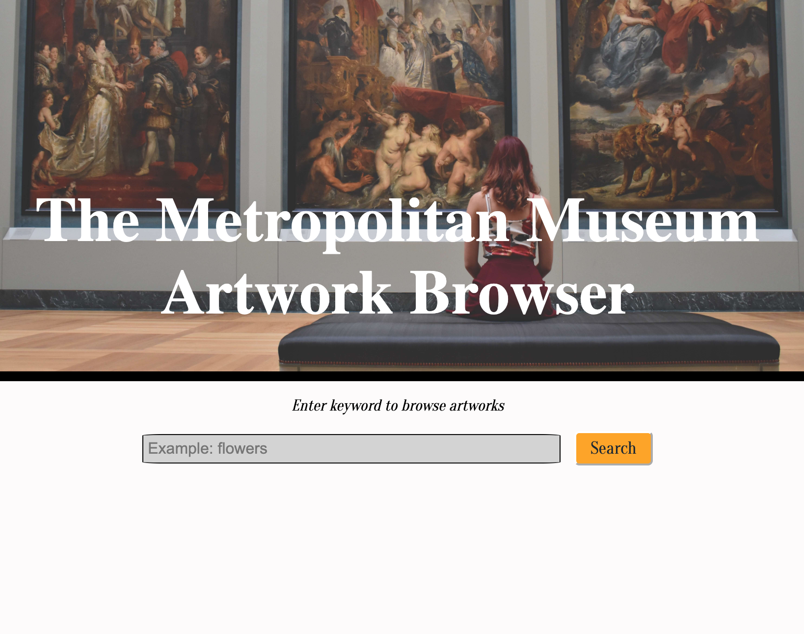
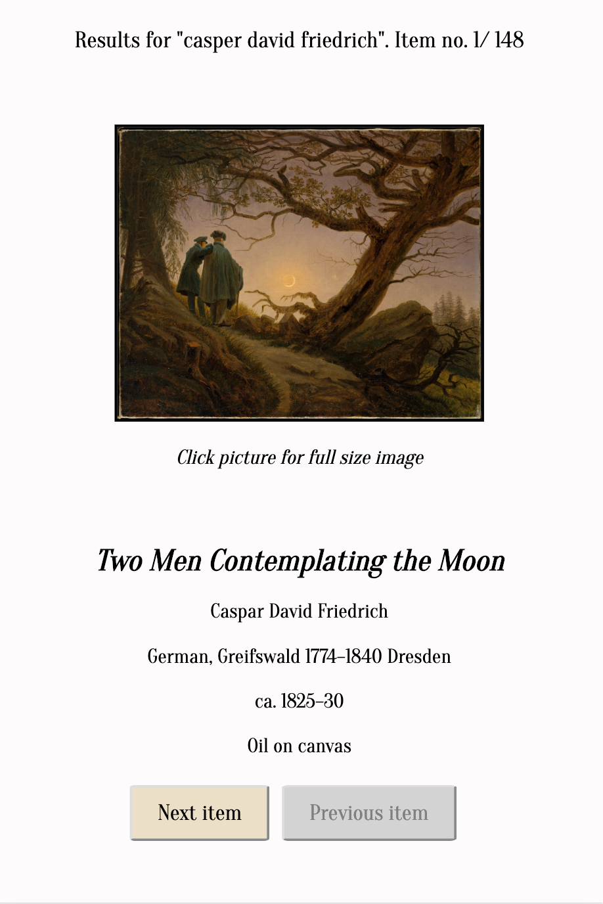

## Metropolitan Museum Artwork Finder

#### A simple app for looking up artworks from the Metropolitan Art Museum catalog by keyword search.

https://bc1985.github.io/Met-Artwork-Finder/

##### Screenshots

##### Summary

This app uses the [Metropolitan Museum of Art's API](https://metmuseum.github.io/) which contains images and information about thousands of artworks in its catalog. Simply enter a keyword and the app will return an array of catalog items related to the keyword which you can scroll through with a click of a button. Each item description contains relevant useful information and the images are clickable and lead to a full-size image in a separate tab. 

Note: Some keywords will not be apparent in the item description, however, they exist within a different attribute in the backend that may not be displayed for UX purposes. 

##### Programming languages used: 

- HTML 
- CSS 
- jQuery

##### Features
- Access to The Metropolitan Museum of Art's thousands of fascinating artworks from ancient history to modern day.
- Look up works by artist name, name of artwork, medium or keywords.
- Detailed information about each artwork.
- Links to artist Wikipedia page (when applicable).
- Links to high resolution images from clickable image.
